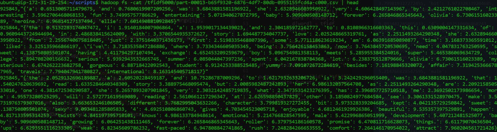
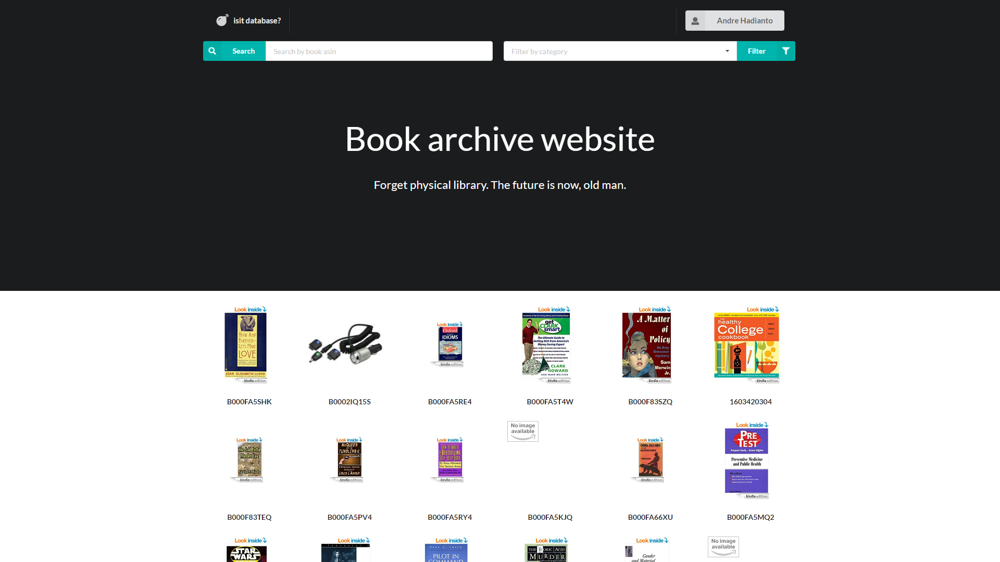
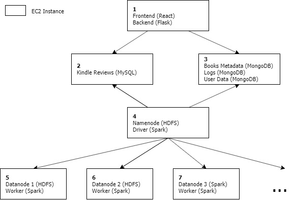

# 50.043 Project
## Automated Use Flow
### Prerequisites
- Use Ubuntu 18.04 LTS (due to use of bash scripts)
- AWS EC2 key pair created in the region 'ap-southeast-1'

**Take Note**
- Notable events will be printed on the console to show progress. All actions and events will be added to the log file, which can be found at `/automation/config/logs.log`
- The estimated time required for setting up is 20min and the estimated time for analytics can be found in the table [below](#estimated-runtime).
- Amazon performs status checks on the instances, which monitors the software and network configurations. These checks could fail due to various reasons, this is outside of our control and cannot be resolved using Boto3. In that case, terminate all instances and try again.

### Instructions
1. Clone the project repository using the following command
    ```
    git clone https://github.com/andrehadianto/50043_isit_database.git
    ```
2. In the automation folder, create a virtual environment and install the requirements
    ```
    virtualenv env
    source env/bin/activate
    python -m pip install -r requirements.txt
    ```
3. Run main.py to setup and configure the EC2 instances, and run the analytics. This will take 20-30min.
    ```
    python3 main.py <access key> <secret access key> <key pair name> <**absolute** pem file directory> <cluster size>
    ```
4. The public IP of the EC2 instance hosting the web application will be printed on the console. The website can then be viewed at `<public IP 1>:5000/isit`
5. To initiate the analytics again, run 
    ```
    python analytics.py
    ```
    To change the cluster size, run
    ```
    python clean.py
    python3 main.py <access key> <secret access key> <key pair name> <**absolute** pem file directory> <cluster size>
    ```
6. Upon completion of the analytics task, the time taken will be printed on the console. The results will be stored in HDFS. The file location will be printed on the console. To see the files, ssh into the namenode and run
    ```
    hadoop fs -ls /tfidf
    hadoop fs -ls /corr
    ```
    A sample of the TF-IDF and correlation analytics output can be seen below. <br/>
    
    TF-IDF
    <br />
    correlation<br />
    <br />

### Estimated Runtime
The estimated runtime (in min) for performing the analytics task on various vocabulary sizes and cluster sizes are as follows,

| vocabulary size | 2 nodes | 4 nodes | 8 nodes |
|-----------------|---------|---------|---------|
| 2000            | 10      | 4       | 2       |
| 5000            | 20      | 7       | 3       |
| 10000           | -       | -       | 6       |


## Description
In this project, we built a web application for Kindle book reviews, similar to [Goodreads](https://goodreads.com). You will start with some public datasets from Amazon, and will design and implement your application around them. The requirements below are intended to be broad and give you freedom to explore alternative design choices. The full details of the project requirements can be found [here](https://github.com/dinhtta/istd50043_project/blob/master/README.md).

### Dataset
We were provided with 2 public datasets from Amazon.
+ Amazon Kindle's reviews, available from [Kaggle website](https://www.kaggle.com/bharadwaj6/kindle-reviews). 
This dataset has 982,619 entries (about 700MB).
+ Amazon Kindle metadata, available from [UCSD website](http://jmcauley.ucsd.edu/data/amazon/)
This dataset has 434,702 products (about 450MB)
<br/>
After cleaning the dataset, we loaded the data into the respective databases.

## Table of Contents
* [Automated Use Flow](#automated-use-flow)
  + [Prerequisites](#prerequisites)
  + [Instructions](#instructions)
  + [Estimated Runtime](#estimated-runtime)
* [Description](#description)
  + [Dataset](#dataset)
* [Frontend](#frontend)
  + [Requirements](#requirements)
  + [Framework](#framework)
  + [Features](#features)
  + [Preview](#preview)
* [Production Backend](#production-backend)
  + [Requirements](#requirements-1)
  + [Framework](#framework-1)
  + [Design](#design)
* [Analytics Backend](#analytics-backend)
  + [Requirements](#requirements-2)
  + [Approach](#approach)
    - [Correlation](#1-correlation)
    - [TF-IDF](#2-tf-idf)
* [Automation](#automation)
  + [Requirements](#requirements-3)
  + [Design](#design-1)
  + [Use Flow](#use-flow)

## Frontend
### Requirements
This consists of a web page that let an user perform at least the following:
* See some reviews
* Add new review
* Add a new book
You are free to use any Web framework you want, and free to decide your own structure and layout. As long as I can enter input and get my output. Pretty website will earn you more points, to a certain limit.
And feel free to add more functionalities as the project progresses.

### Framework
We used ReactJS for our frontend because it is fast, scalable, and simple. It allows us to create a web application which can change data, without reloading the page. React also allows us to create reusable UI components, making our code lighter and less repetitive.
The full documentation on the usage can be found [here](/static).

### Features
The features implemented on our web application is as follows:
* Homepage of our webiste shows a list of all books available in our database. User may sign up and login to our website.  
* Filter the books by multiple categories. Type inside the input form for category suggestions.  
* Filtered books will show the filtered categories in the labels by upper-left corner.  
* Search a book by its asin code.  
* User may login to gain access to user-only features.
* User may sign up a new account. Username is unique.  
* User-only features consist of Adding new books, Seeing logs, and logging out.  
* Selecting a book will show the book details. You can see the title if available, the genre, author, description, and its price. Below shows all the available reviews by other users and the overall ratings.  
* Anonymous user may post a review using a nickname of their own choice.  
* Logged in user does not have to choose a nickname and their review will be based on their entered display name.  
* Logged in user can add a new book. The preview of the book can be seen before submitting the book.  
* User can check the details of successful new book submission immediately.  
* Logged in user may see the list of logs.  
* View details of a log.  

### Preview
This is a preview of our frontend
<p align="center">

</p><br />
The full implementation of our frontend and the various features supported by our web application can be found [here](/static).

## Production Backend
### Requirements
* The web server receives requests and computes the responses by interacting with the databases. 
* The reviews are stored in a relational databases (SQL is recommended).
* The metadata (book descriptions) is in a document store (MongoDB).
* The web server logs are recorded in a document store. Each log record must have at least the following information:
  + Timestamp
  + What type of request is being served
  + What is the response

### Framework
Our server uses Flask because it allows for more control about which components to use, such as what databases and how to interact with them. Since our project requires us to connect with multiple SQL and Mongo databases, we decided that Flask was most suitable.
The full documentation on the usage can be found [here](/server).

### Design
#### 1. Books Metadata
**Schema (MongoDB)**
* id: ObjectId, primary key
* asin: String
* title: String
* categories: String[]
* imUrl?: String
* related?: json
  + also_bought: string[]
  + also_viewed: string[]
  + bought_together: string[] 
* price?: Double
* description?: String

**Endpoints**

| Endpoint                    | REST | Description                                                  |
|-----------------------------|------|--------------------------------------------------------------|
| /book/:asin                 | GET  | Returns book details (all available fields), erroneous asin in array will be ignored<br/><ul><li>Parameter: asin</li><li>Body: json(id, asin, title, categories, imUrl, related?, price?, description?)</li></ul> |
| /books?page={}&count={}     | GET  | Returns books information (lightweight) with pagination<br/><ul><li>Body: Array of json(asin, title, imUrl?)</li><li>Use Case: Home Page, viewing of ALL books</li></ul> |
| /books/previews/            | POST | Returns books information (lightweight)<br/><ul><li>Request Body: (asinArray) Array of string</li><li>Response Body: Array of json(asin, title, imUrl)</li><li>Use case: view also bought/also viewed/bought together</li></ul> |
| /books/category             | POST | Returns books that have categories containing categories in categoryArray<br/><ul><li>Request Body: (categoryArray) Array of string</li><li>Response Body: Array of json(asin, title, imUrl)</li><li>Use case: filtering of categories</li></ul>|
| /book/new                   | POST | Adds a book to database<br/><ul><li>Body: json(title, categories?, imUrl, related?, price?, description)</li><li>Backend: perform check on imUrl (If empty: add in hard-coded url)</li></ul> |
| /book/update/:asin          | PUT  | Updates book details<br/><ul><li>Parameters: asin</li><li>Body: json(title, categories, imUrl, related?, price?, description)</li></ul> |
| /category/all               | GET  | Returns all available book category<br/><ul><li>Use Case: Add new book, selecting category</li><li>Body: Array of json(category)</li></ul> |
| /user/logs?page={}&count={} | GET  | Returns a list of logs<br/><ul><li>Body: count, logs(status code, method, path, body)</li></ul> |
| /user/logs/:id              | GET  | Returns a specific log in details<br/><ul><li>Parameters: ObjectId</li><li>Body: status code, time, method, path, body</li></ul> |
| /user/login                 | POST | Log in to an account into the website |
| /user/signup                | POST | Sign up a new account into the database |
| /books_titles               | GET  | Returns books that have titles in the metadata -Body: titles, asin |
| /user/login                 | POST | Returns user data for authorization -Body: name, id, token |
| /user/signup                | POST | Returns status code of sign up result |

#### 2. Kindle Reviews
**Schema (MySQL)**
* id: Integer, primary key
* asin: String
* helpful: String
* overall: Integer
* reviewText: Text
* reviewTime: String
* reviewerID: String
* reviewerName: String
* summary: String
* unixReviewTime: Integer

**Endpoints**  

| Endpoint                        | REST   | Description                                                  |
|---------------------------------|--------|--------------------------------------------------------------|
| /reviews/:asin?page={}&count={} | GET    | Returns reviews details (all fields) for a book with pagination<br/><ul><li>Body: Array of json(id, asin, helpful, overall, reviewText, reviewTime, reviewerID, reviewerName, summary, unixReviewTime)</li></ul> |
| /reviews/:asin                  | POST   | Adds a review to database<br/><ul><li>Body: json(asin, overall, reviewText, reviewerID, reviewerName, summary)</li></ul> |
| /reviews/user/:userid           | GET    | Returns all reviews by user<br/><ul><li>Body: Array of json(id, asin, helpful, overall, reviewText, reviewTime, reviewerID, reviewerName, summary, unixReviewTime</li></ul> |
| /review/:id                     | DELETE | Delete review |
| /review/:id                     | PUT    | Edit review by user<br/><ul><li>Body: json(overall, reviewText, summary)</li></ul> |

#### 3. Logs
**Schema (MongoDB)**
* id: Integer, primary key
* time: String
* body: String
* method: String
* path: String
* status: String
* statuCode: Integer

### Analytics Backend
#### Requirements
You will build a analytics pipeline and system that comprises:
1. You will first write a script that saves data from the production system, and then loads the data to a distributed file system (HDFS) in the analytics systems.
2. Write the following applications in Spark.
  + *Correlation*: compute the Pearson correlation between price and average review length. You are to implement in a map-reduce fashion, and are not allowed to use mllib.stat.Satistics.
  + *TF-IDF*: compute the term frequency inverse document frequency metric on the review text. Treat one review as a document.

#### Approach
##### (1) Correlation
To compute the Pearson correlation between price and average review length, we would first need to retrieve these data from HDFS. Since price is from the `Meta` dataset while the reviews are from the `Reviews` dataset, we would need to fetch the two datasets and do some preprocessing. 

The proprocessing includes getting the average `reviewText` length for each book (`asin`). Thereafter, we join the two datasets using `asin` and extracted the `average_reviewLength` and `price` required for our correlation computation. 

We made use of the **MapReduce** concept for the computation. In the mapping stage, we mapped each row to its `x`, `x**2`, `xy`, `y` and `y**2` values. (Let x = price and y = average_reviewLength). This is done via:

```
flatdata = data.flatMap(lambda row: (     #row -> price, average_reviewLength
	("x", row[0]),
	("y", row[1]),
	("x2", row[0] * row[0]),
	("y2", row[1] * row[1]),
	("xy", row[0] * row[1])))
```

Next, in the reducing stage, we reduced by key and summed up all the values in each keys. Thereafter, we sorted by key so that we can get an absolute order we can slice from.

```
# Sort by key so that we will get an order we can slice from
reduced_data = flatdata.reduceByKey(lambda x,y: x+y).sortByKey()

# Retrieving our terms required for calculating the correlation
end_data = reduced_data.take(5)
x = end_data[0][1]
xx = end_data[1][1]
xy = end_data[2][1]
y = end_data[3][1]
yy = end_data[4][1]
```

Now that we have , computing the Pearson correlation is straightforward. We simply use the formula as follows in order to do the computation.

<p align="center">
  
</p>

After running the analytics scripts detailed in the next section, the output for the correlation script can be found in hdfs under the /corr/ directory. The value of the Pearson's correlation coefficient can be found in one of the files (`part-0000X`) in that directory. 
```
hadoop fs -ls /corr
```


##### (2) TF-IDF
The second analytic task was to compute the term frequency inverse document frequency metric on the reviews where each review is a document.

(a) **Convert each review to an array of words**
```
tokenizer = Tokenizer(inputCol="reviewText", outputCol="words")
wordsData = tokenizer.transform(data)
```

(b) **Get the term frequency vectors**

We used `CountVectorizer` to compute the term frequency vectors instead of `HashingTF` even though it is slower because `CountVectorizer` is able to restore the word vocabulary.
```
cv = CountVectorizer(inputCol="words", outputCol="rawFeatures")
model = cv.fit(wordsData)
featurizedData = model.transform(wordsData)
```

(c) **Apply IDF**
```
featurizedData.cache()
idf = IDF(inputCol="rawFeatures", outputCol="features")
idfModel = idf.fit(featurizedData)
rescaledData = idfModel.transform(featurizedData)
```

(d) **Convert word index back to word**

After using `CountVectorizer`, it indexes each word and thus each word is now represented by an integer index. In order to recover the words back we created a user-defined function (`udf`) and applied it to our dataframe. 

```
# trying to map the index of word -> actual word cause CountVectorizer gives index
def map_to_word1(row, vocab):
    d = {}
    array = row.toArray()
    for i in range(len(row)):
        # if it is 0 -> ignore, else change the key to corresponding word
        if (array[i] != 0):
            tfidf = array[i]
            word = vocab[i]
            d[word] = tfidf
    return str(d)

def map_to_word(vocab):
    return udf(lambda row: map_to_word1(row, vocab))

# apply udf to convert index back to word
df = rescaledData.withColumn("modified", map_to_word(vocab)(rescaledData.features))
```

After running the analytics scripts detailed in the next section, the output for the tfidf script can be found in hdfs under the /tfidf/ directory 
```
hadoop fs -ls /tfidf
```


### Automation
#### Requirements
The requirements for the scripts are as follows:
* No managed service such as EMR and RDS.
* Your scripts are expected to:
  + Take my AWS credentials as input. (For the analytic tasks, your scripts also take the number of nodes).
  + Spin up new instances from a base Ubuntu image. Only most basic OS packages are installed in the base image.
  + Configure and start your systems (both production and analytics). Your scripts tell me how/where to access the front end.
  + Have options to start the analytic tasks.
  + You can save the results of the analytic tasks to file, and tell me how/where to access the file.

#### Design
The EC2 instances will be setup as in the following structure
<br />

| Instance Number | Content                 | Details        |
|-----------------|-------------------------|----------------|
| 1               | <ul><li>Frontend (React)</li><li>Backend (Flask)</li></ul> | The frontend and backend is hosted at port 5000, the website can be viewed at &lt;public IP 1&gt;:5000/isit. The backend retrieves information from the databases via their IP addresses. |
| 2               | Kindle Reviews (MySQL)  | The data can be accessed by the backend and namenode at &lt;public IP 2&gt;:3306. |
| 3               | <ul><li>Books Metadata (MongoDB)</li><li>Logs (MongoDB)</li>User Data (MongoDB)</li></ul> | The data can be accessed by the backend and namenode at &lt;public IP 3&gt;:27017. |
| 4               | <ul><li>Namenode (HDFS)</li><li>Driver (Spark)</li></ul> | The namenode is configured to store the public DNS of the datanodes. The HDFS cluster can be view at &lt;public IP 4&gt;:50070. When the client issues an analytics job, data is retrieved from the databases via their IP addresses. The driver delegates tasks to the workers by ssh-ing into the datanodes. Upon completion, the driver returns the output file. |
| 5+              | <ul><li>Datanode (HDFS)</li><li>Worker (Spark)</li></ul> | The worker performs the tasks assigned by the driver. |

#### Use Flow
Refer to [here](#automated-use-flow) for instructions to run automated setup.
